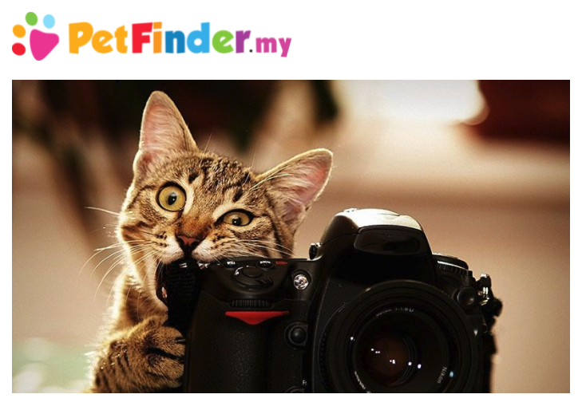

# [PetFinder.my - Pawpularity Contest](https://www.kaggle.com/c/petfinder-pawpularity-score)



# OverView
一枚の絵は千の言葉に値する。しかし、1枚の写真が1,000の命を救うことができることをご存知でしたか？世界中で毎日、何百万匹もの野良動物が路上で苦しんだり、保護施設で安楽死させられています。魅力的な写真を持つペットは、より多くの関心を集め、より早く採用されると思うかもしれません。しかし、良い写真とは何でしょうか？データサイエンスの助けを借りれば、ペットの写真の魅力を正確に判断し、救助された動物たちがより多くの人に愛されるチャンスを得られるよう、改善策を提案することができるかもしれません。

PetFinder.myは、マレーシアを代表する動物福祉プラットフォームで、18万頭以上の動物が登録され、5万4千頭が幸せな養子縁組をしています。ペットファインダーは、動物愛好家、メディア、企業、グローバル組織と密接に協力し、動物福祉の向上に努めています。

現在、PetFinder.myでは、ペットの写真をランク付けするために、基本的なCuteness Meterを使用しています。これは、写真の構図やその他の要素を分析し、何千ものペットのプロフィールのパフォーマンスと比較するものです。この基本的なツールは有用ですが、まだ実験的な段階であり、アルゴリズムは改善できる可能性があります。

このコンペティションでは、生の画像とメタデータを分析して、ペットの写真の「Pawpularity」を予測します。このモデルは、PetFinder.myの何千ものペットのプロフィールを使ってトレーニングとテストを行います。採用されたモデルは、動物福祉を向上させるための正確な推奨事項を提供します。

成功すれば、世界中のシェルターやレスキュー隊がペットのプロフィールの魅力を向上させるためのAIツールに採用され、自動的に写真の品質を向上させたり、構図の改善を推奨したりすることになります。その結果、野良犬や野良猫がより早く「運命の人」を見つけることができるようになります。Kaggleコミュニティのちょっとした支援で、多くの尊い命が救われ、より多くの幸せな家族が生まれるかもしれません。

上位の参加者には、ソリューションの実装に向けた共同作業に招待される可能性もあり、AIのスキルで世界の動物福祉を創造的に改善することができます。

# Evaluation
ルート平均二乗誤差 𝑅𝑀𝑆𝐸
投稿作品はRMSE（ルート・ミーン・スクウェア・エラー）で採点されます。RMSEは次のように定義される。

RMSEは次のように定義される： $$\textrm{RMSE} = \sqrt{\frac{1}{n} \sum_{i=1}^{n} (y_i - \hat{y}_i)^2} $$

ここで、$\hat{y}_i$は各インスタンス(i)の予測値、(y_i)は元の値です。

提出ファイル
テストセットの各Idに対して，対象変数であるPawpularityの確率を予測する必要があります．ファイルはヘッダを含み，以下の形式で作成してください．
```
Id, Pawpularity
0008dbfb52aa1dc6ee51ee02adf13537, 99.24
0014a7b528f1682f0cf3b73a991c17a0, 61.71
0019c1388dfcd30ac8b112fb4250c251, 6.23
00307b779c82716b240a24f028b0031b, 9.43
00320c6dd5b4223c62a9670110d47911, 70.89
etc.
```

# log
# 2021/11/26
* 初コンペ
* 締切日：2022年1月13日 - 最終提出期限
    * UTC時間なので注意
* 最後まで走り切ろう
* まず何をすべきか
    * 他のkagglerと比べると圧倒的にinput量、知識が少ない
    * たくさん時間をかけて先人達の知恵Disucussion, Codeを読み漁る
    * 気づいたこと、inputしたことをここに記述していく

# 11/28
* Disucussionより
    * LB 17.8744スコアで試したこと
        * Model : Imagenet22k
        * Ensemble : 10-fold mean
        * 回帰ではなく分類
        * 画像生成・変換 : 単純なランダム・リサイズ・クロップ
            * ミックスアップやオーグメンテーションを追加してみたが、あんまり効果がなかったらしい
        * ラベルのないデータを生成する必要あり？
            * 与えられた学習セットが小さく、学習の過程でモデルがオーバーフィットしてしまうので、自己学習や整合性正則化などの準スーパーテクニックを使って、より多くのラベルのないデータを利用しようと考えている。

# 11/29
* CodeのHotnessより
    * petfindder-updated-rules.ipynbをコピー&Submitすると、なんと287/2470に。
    

    * ここで行っているデータ加工・訓練を参考にすると有用な特徴量が見えてくるかも
    * petfindder-updated-rules.ipynbは英語ベースなので日本語で書き起こしてみる

# 12/4
* 11/29の続き
* petfindder-updated-rules.ipynbは英語ベースなので日本語で書き起こし
    * 結構サボってた
    * 学習をして予測結果が出るところまでは翻訳していない
* 気づいたこと
    * 画像に対して特別(特殊な)加工しているわけでもない
    * fastaiのライブラリベースで加工している
        * ImageDataLoaders.from_dfを使ってデータフレームの生成をしている
        * fit_one_cycleでワンサイクル・ポリシーを使って早く学習する

### fit_one_cycle
* fastaiのドキュメント参考
* ※fastaiのドキュメントに1CyclePolicyの説明あり。

「Leslie Smith’s 1cycle policy」とよばれるもので、学習をすばやく収束させる学習率調整方法。元論文の学習サイクル数の比較例では、よく使われる方法（学習が進むにつれて学習率を小さくする方法）で約8万サイクルかかっているところ、約1万サイクルで学習できている。

# 12/5
* テスト

# 12/8
* Discussion Hotness
    * https://www.kaggle.com/c/petfinder-pawpularity-score/discussion/286250
    * 〆切がもうすぐなので一旦まとめ
    * sishuochenによってLBのベースラインが17.8744点となる爆弾発言があったらしい
    * 上記実装では単純なランダム・リサイズ・クロップとランダム・フリップ・オーグメンテーション(画像かさ増し？)による分類を使用している
    * **この瞬間からKagglerは動物園のモデル？のトランスフォーマー部分**を探すようになった
        * つまり動物園にいる動物の画像でかさ増し？加工？ってこと？
    * 終盤に差し掛かるにつれて犬は猫よりも分類するのが遥かに難しいという議論が行われた

# 12/15
* Discussion
    * モデルが優れているかどうかを評価するための手法は**RMSEが標準偏差よりも低いかどうかをチェックする**こと。
    * 与えられたデータだけでは正しく予測することはほぼ不可能
    * single model cv 17.5 LB 17.90
        * swin transformerを使った
        * https://github.com/microsoft/Swin-Transformer
        * 損失関数はCrossEntropyを使った
        * 5フォールド使用した
        * 32ステップごとに評価することでエポック終了時に評価するよりもいい結果が得られた
        * 学習過程でmixupを使うことでオーバーフィッティングを防げた

# 12/21
* Discussion
    * ニューラルネットワーク
        * InputLayer
        * Flatten
        * Dense
        * Dense
        * のようなニューラルネットワークを構築するのもアリ
    * 公開されたNotebookでfastaiをよく見る
        * fastai自体は深層学習を簡単に行うことができるPythonのパッケージ
        * Kaggleの画像コンペではfast.aiベースの解法がKernel上でよく共有される
        * あくまでお試し用のライブラリで煩雑な部分が一切無いため、簡単にNNを組むことができる。fast.aiを極める意味はあまりないらしい
        * じゃあ何を見れば？
            * →一旦fastaiの流れを抑えておくに越したことはない。
            * これを踏まえて、CNNやResNet, ImageNetを利用するのが良いのか

# 12/28
* 初心者のためのデータセットの扱い方・手順
* https://www.kaggle.com/pythonash/how-to-handle-dataset-for-beginners
    * とりあえずデータフレームに落とし込んで中身を見る
    * 欠損値があるか確認する
    * データの重複があるか確認する
    * 0 or 1のデータ値なのでデータの偏り方がどうなのか確かめるため、棒グラフにする
    * 目的変数のスコアがどうなっているか描画する(棒グラフ+折れ線グラフ)
        * Y軸に密度、X軸に魅力度(Pawpularity)
    * テストデータをチラッと確認(test.head())
    * 欠損値があるか確認
    * 画像コンペなので画像データのサイズを確認する
        * for文で回して各画像のwidth, height, channelを取得(opencv?)
    * 一番小さいサイズの画像サイズを確認する
    * value_counts()でどの画像サイズが多いのか確認
    * 画素構造を確認する
        * width*height = 960 * 720 だった
    * 学習用画像データの読み込みとリサイズをする
        * 画像サイズを64*64にする
            * なぜ64*64？->メモリ割り当てで詰まるらしい
            * 画像データセットが多すぎてメモリが爆発してしまう
            * 画像を64*64に縮小(リサイズ)することでメモリを確保する
        * ピクセルを255で割ってリサイズする(0~1の間にする正規化)
            * この処理では、cv2.INTER_AREAというパラメータを使うと、補間処理を行うことができる
    * 画像と各IDの対応づけ
        * 画像データセット順とcsvファイル順を一致させる
        * 訓練データを再度インデックスを振り直す
        * リサイズ加工したデータとオリジナルデータを確認してみる
    * テストデータセットの読み込み・スケールサイズは？
        * テストデータは(128, 128, 3)だが、メモリサイズの問題で64*64にリサイズする必要がある
        * テストデータセットを解析するために学習画像とテスト画像のサイズを同じにする

以上で、このデータセットを訓練用とテスト用に使い分け、スコアを取得する準備ができた。

テスト画像が動物に見えないのはなぜか？(リサイズ加工などをしてるからモザイクになっている)

また、このデータセットが解析に使えるかどうかも気になるところ。
->同筆者の別ノートブックに色々ヒントを記載しているらしいので探してみる。

# 2022/01/04
#### ニューラルネットワークによる画像分類・回帰のコツ
* https://www.kaggle.com/c/petfinder-pawpularity-score/discussion/288896

この記事では画像ベースモデルの性能を向上させるためにネットワークアーキテクチャに加えるべき調整事項を紹介する。

### 学習時に利用する補強

1. [3/4, 4/3]の縦横比の長方形の領域をランダムに切り取り、[8%, 100%]でランダムにサンプルして最後にimg_size x image_sizeの正方形にリサイズする
2. これをバッチ毎にランダムに実行する
3. ランダムな水平反転を加える(ex: 0.5...)
4. 色相、彩度、明度をランダムに変更し[0:6;1:4]に比例する係数を選択する
5. 各チャンネルを平均値で引き標準値で割ってRGBチャンネルを正規化する

### テスト時
---
* 縦横比はそのままに短辺をimg_sizeにリサイズし、中央の(img_size-1)x(img_size-1)の部分を切り取る
* 上記のように標準化する

### 重みの初期化
---
* 畳み込みと完全連結層を「Xavier重み」で初期化する?：[-a, a]で一様なランダム値をとる

$$a=\sqrt{(\frac{6}{d_{i}n+d_{o}ut})}$$

ここで、d_in と d_out はそれぞれレイヤーの入力と出力のチャンネル数である。
* バイアスを0に初期化
* バッチ正規化: アルファとベータをそれぞれ1と0に初期化する
* LRスケジューラをまだ持っていない場合0.1に初期化し、数エポックごとに10で割るのが良い基本的な方法

### 効果的なトレーニング
---